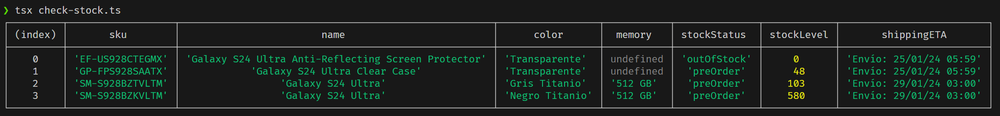
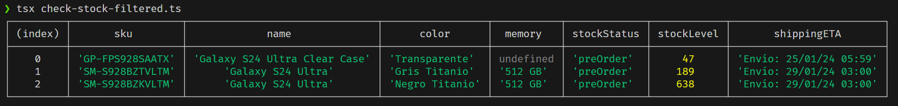

# s24-stock-checker
Simple script to fetch stock from Samsung S24 Ultra and others

## Install

`npm install`
## Examples

---

Fetching stock of 4 products:
* Anti reflecting screen protector
* Transparent case
* Samsung S24 Ultra black
* Samsung S24 Ultra gray
```typescript filename="check-stock.ts"
import { fetchStock } from './fetch-stock/fetch-stock.ts'
import { SamsungSKU } from './fetch-stock/skus.ts'

const pdpUrls = [
  "https://www.samsung.com/mx/mobile-accessories/galaxy-s24-ultra-anti-reflecting-screen-protector-transparent-ef-us928ctegmx",
  "https://www.samsung.com/mx/mobile-accessories/galaxy-s24-ultra-clear-case-transparent-gp-fps928saatx/",
  SamsungSKU.ultraNegro512GB,
  SamsungSKU.ultraGris512GB]

async function checkStockFromUrls() {
  const stock = await fetchStock(pdpUrls)
  console.table(stock)
}

checkStockFromUrls()
```

`tsx check-stock.ts`



---

Applying filter `item.stockStatus !== 'outOfStock'`

```typescript filename="check-stock-filtered.ts"
import { fetchStock } from './fetch-stock/fetch-stock.ts'
import { SamsungSKU } from './fetch-stock/skus.ts'

const pdpUrls = [
  "https://www.samsung.com/mx/mobile-accessories/galaxy-s24-ultra-anti-reflecting-screen-protector-transparent-ef-us928ctegmx",
  "https://www.samsung.com/mx/mobile-accessories/galaxy-s24-ultra-clear-case-transparent-gp-fps928saatx/",
  SamsungSKU.ultraNegro512GB,
  SamsungSKU.ultraGris512GB]

async function checkStockFromUrls() {
  const stock = await fetchStock(pdpUrls)

  console.table(stock.filter((item) => (
    item.stockStatus !== 'outOfStock')
  ))
}

checkStockFromUrls()
```

`tsx check-stock-filtered.ts`

